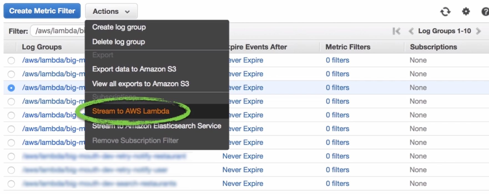

# Logzio Shipper

We developed this to _ship_ logs from Amazon Cloudwatch to the [Logzio](https://logz.io/)
ELK stack. We do this by providing a "shipper" lambda function which you will attach to
your existing log streams in Cloudwatch.



If you're interested in a AWS logging framework then we recomment
[aws-log](https://github.com/inocan-group/aws-log) as we built it for just this purpose.

> **Note:** If you want to use a different logging framework that's probably ok too but
> just be sure that it emits structured JSON data when writting to stdout.

## Getting Started

Use the steps below to get your logs into Logzio.

1. Ensure you have the Serverless Framework installed (or upgrade to latest):

   ```sh
   # yarn
   yarn global add serverless
   # npm
   npm install -g serverless
   ```

2. Install (or upgrade to latest) the Yeoman Generator:

   ```sh
   # yarn
   yarn global add yo
   # npm
   npm install -g yo
   ```

3. Go to your serverless repo's root directory
4. Download and run the `logzio-shipper` yeoman template:

   ```sh
   # yarn
   yarn global add generator-logzio-shipper
   # npm
   npm install -g generator-logzio-shipper

   # and then, yeoman
   yo logzio-shipper
   ```

   The template install will do the following:

   1. Install the `logzio-shipper` repo (aka, _this_ repo) as a dependency to your project
   2. Using your `serverless.yml` and `~/.aws/credentials` files, it will set key
      variables for logzio (port, host, and token) into your AWS's
      [SSM](https://docs.aws.amazon.com/systems-manager/latest/userguide/systems-manager-paramstore.html).
   3. Add a definition for the `logzioShipper` handler in your `serverless.yml` file (if it's not
      there already)

> Note: **SSM** is a great way to store important but secure data that doesn't fit well
> into an environment variables. If you're interested in what variables are set you can
> type `` in your console (assuming you've installed the AWS CLI)

## Shipper

Lorem ipsum dolor sit amet consectetur adipisicing elit. Facilis at ab recusandae fugiat,
saepe molestiae doloribus assumenda rem voluptates non illum nemo dolorem architecto animi
obcaecati esse eius et iure

## Subscriber

Lorem ipsum dolor sit amet consectetur adipisicing elit. Facilis at ab recusandae fugiat,
saepe molestiae doloribus assumenda rem voluptates non illum nemo dolorem architecto animi
obcaecati esse eius et iure

[CloudTrail Pricing](https://aws.amazon.com/cloudtrail/pricing/)

## Log Retention

Lorem ipsum dolor sit amet consectetur adipisicing elit. Facilis at ab recusandae fugiat,
saepe molestiae doloribus assumenda rem voluptates non illum nemo dolorem architecto animi
obcaecati esse eius et iure

## LICENSE

Copyright (c) 2019 Inocan Group

Permission is hereby granted, free of charge, to any person obtaining a copy of this
software and associated documentation files (the "Software"), to deal in the Software
without restriction, including without limitation the rights to use, copy, modify, merge,
publish, distribute, sublicense, and/or sell copies of the Software, and to permit persons
to whom the Software is furnished to do so, subject to the following conditions:

The above copyright notice and this permission notice shall be included in all copies or
substantial portions of the Software.

THE SOFTWARE IS PROVIDED "AS IS", WITHOUT WARRANTY OF ANY KIND, EXPRESS OR IMPLIED,
INCLUDING BUT NOT LIMITED TO THE WARRANTIES OF MERCHANTABILITY, FITNESS FOR A PARTICULAR
PURPOSE AND NONINFRINGEMENT. IN NO EVENT SHALL THE AUTHORS OR COPYRIGHT HOLDERS BE LIABLE
FOR ANY CLAIM, DAMAGES OR OTHER LIABILITY, WHETHER IN AN ACTION OF CONTRACT, TORT OR
OTHERWISE, ARISING FROM, OUT OF OR IN CONNECTION WITH THE SOFTWARE OR THE USE OR OTHER
DEALINGS IN THE SOFTWARE.
